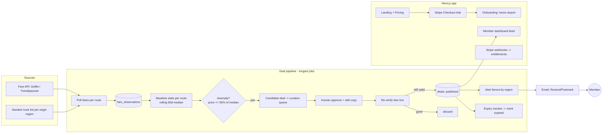

# Triips.com — Product Teardown & From-Zero Build Blueprint

> Research date: July 14, 2026. Direct fetching of triips.com was blocked from this
> environment (Cloudflare bot protection + network policy), so the teardown is
> assembled from the site's indexed pages (home, /pricing/, /faq/), Trustpilot, and
> six independent reviews. Facts below are labeled **confirmed** (multiple sources)
> or **inferred** (industry-standard practice for this product category).

---

## Part 1 — What Triips actually is

**One-liner:** a paid membership "cheap flight club." Members pick a home airport;
Triips' system watches fares departing that region and emails 2–3 hand-picked deals
per week that are 50–90% below typical price. It sells *discovery*, not travel.

This is the same category as Going.com (ex-Scott's Cheap Flights), Jack's Flight
Club, and Dollar Flight Club. The product is **an alerting business wrapped around a
fare-anomaly detector**, monetized by subscriptions — not a booking engine, not an
OTA.

### Confirmed facts

| Aspect | Detail |
|---|---|
| Positioning | Homepage title: "Never Pay Full Price for a Flight Again" |
| Model | Subscription membership; 7-day free trial (exactly 168 hours), card required up front, auto-converts to paid |
| Price | $59/yr framed as "~$4.9/mo" (some reviews cite $99/yr — they appear to A/B test price points) |
| Cadence | 2–3 deal alerts per week |
| Claimed savings | 50–90% below regular price |
| Coverage | Departures from US & Canada only |
| Booking | None. Deal links redirect to the airline or a standard booking engine — pure discovery tool |
| Member area | Minimalist dashboard: a feed of recent deals for your region |
| Alerts | Email with the deal, available date ranges, and a booking link |
| Billing | Stripe; cancellation via the Stripe customer billing portal; access runs to end of period; ToS says payments are final/non-refundable |
| Marketing claim | "Full refund if you don't save $500+" on the pricing page — which contradicts the no-refund ToS (a major trust problem, see Part 6) |
| History | Rebranded from "Fair Fare Club" |
| Reputation | ~4.0 on Trustpilot; praise for real savings, recurring complaints about surprise trial-to-paid charges and deals that vanish before booking |

### Site map (public)

```
/            Landing page (hero, how-it-works, sample deals, social proof, pricing CTA, FAQ teaser)
/pricing/    Single plan + trial mechanics + savings-guarantee copy
/faq/        Trial (168h), cancellation, refunds, savings guarantee, coverage
/login → app  Member dashboard (deal feed), profile/membership settings, Stripe billing portal
Terms / Privacy
```

### The funnel (this IS the business)

```
Paid social (TikTok/IG creatives: "I paid $89 to Hawaii") 
  → Landing page (one job: start the trial)
    → Card-up-front 7-day trial (Stripe Checkout)
      → Onboarding: pick home airport/region
        → 2–3 deal emails per week (the retention engine)
          → Auto-convert to $59/yr → renew or churn
```

Everything on the site serves this funnel. When you rebuild it, judge every page,
section, and email against "does this move the funnel?"

### Honest difficulty assessment

| Component | Difficulty | Notes |
|---|---|---|
| Marketing site | Easy | A weekend with the stack below |
| Auth + Stripe trial/subscription | Easy-Medium | Well-trodden; the traps are legal, not technical |
| Deal feed dashboard + emails | Medium | Deliverability is the hard 20% |
| **Fare data + anomaly detection** | **Hard** | The moat. Data access is the #1 constraint (Part 3.3) |
| Trust & retention | Hard | Triips' weak spot — your opening |

---

## Part 2 — Full product spec

### 2.1 Marketing site
- **Home:** hero (headline + subhead + email/CTA), logo/press strip, "How it works"
  (3 steps: Join → We watch fares from your airport → You get alerted & book),
  live-looking sample deals grid (route, was/now price, % off), savings counter,
  testimonials, pricing teaser, FAQ accordion, final CTA, footer (legal, socials).
- **Pricing:** one plan, trial-first framing, guarantee (only if your ToS honors it),
  FAQ, comparison vs "free tools" (Google Flights alerts) to preempt the objection.
- **FAQ, Terms, Privacy, Contact.** Plus a deals blog/regional pages for SEO (Part 8).

### 2.2 Auth & onboarding
- Email+password and Google OAuth. Email verification.
- Onboarding wizard (post-checkout): home airport(s) with autocomplete (store IATA),
  optional dream destinations, cabin preference. Keep it to 1–2 screens.

### 2.3 Deal engine (the moat — full design in Part 3.3)
- Fare ingestion → per-route baseline stats → anomaly detection → **human curation
  queue** → verification at publish time → expiry monitoring ("deal died" state).

### 2.4 Member dashboard
- Deal feed filtered to the member's region: destination photo, route, was/now
  price, % off, date ranges, "Book" (outbound/affiliate link), freshness state
  (Active / Almost gone / Expired).
- Deal detail: dates found, booking instructions, fare rules gotchas (basic economy
  warnings), "prices verified at HH:MM" stamp.
- Settings: airports, email prefs, membership (link to Stripe portal).

### 2.5 Notifications
- Transactional: verify email, receipt, **trial-ending reminder (day 5)**, renewal
  reminder, cancellation confirmation.
- Deal alerts: 2–3/week, one deal per email, big fare visual, dates, one CTA button.
- Later: web push + mobile push for time-sensitive mistake fares.

### 2.6 Billing
- Stripe Checkout (card-up-front trial), Stripe Customer Portal for
  cancel/update, webhooks drive entitlement (never trust the client), dunning via
  Stripe Smart Retries + emails.

### 2.7 Admin
- Curation queue (approve/edit/reject candidate deals), manual deal composer,
  deal kill-switch, user lookup (refund/comp), metrics dashboard (Part 8).

---

## Part 3 — Architecture & stack

### 3.1 Recommended stack (matches this repo's conventions)

| Layer | Pick | Why |
|---|---|---|
| Web app | **Next.js 16 (App Router) + TypeScript** | One codebase for marketing + app; RSC keeps the landing fast; API routes for webhooks |
| Styling | **Tailwind CSS 4** + framer-motion + lucide-react | Ship the landing quickly; already in this repo |
| DB | **PostgreSQL + Prisma** | Relational fits fares/deals/subscriptions; Neon or Supabase managed |
| Auth | **Better Auth** (or Auth.js) | Email+OAuth, session management |
| Payments | **Stripe** (Checkout + Billing Portal + Webhooks) | Trials, dunning, tax (Stripe Tax) solved |
| Email | **Resend + React Email** for product email; move bulk alerts to **Postmark/SES on a separate subdomain** at scale | Deliverability isolation (Part 5.3) |
| Jobs/cron | **Inngest** (or Trigger.dev) | Fare polling, baseline recompute, alert fanout, expiry checks — with retries and observability; Vercel Cron alone is too weak for fanout |
| Cache/queue | Upstash Redis | Dedupe windows, rate-limit budgets, hot fare cache |
| Validation | zod (already here) | API inputs, webhook payloads |
| Hosting | Vercel (app) + worker on Inngest/Fly.io | Long-running polling doesn't belong in serverless request paths |
| Analytics | PostHog + Stripe metrics | Funnel + retention cohorts |
| Errors | Sentry | Especially on webhook + fanout paths |

> Note: Triips' own stack could not be fingerprinted from this environment (bot
> protection). Their funnel (marketing pages + Stripe portal + simple dashboard)
> implies exactly this shape: static-ish marketing front, small app behind auth,
> Stripe for all money. Nothing about the category requires more.

### 3.2 System diagram



### 3.3 Fare data — the critical decision (July 2026 reality)

This is where most clones die. Current landscape:

| Source | Status | Fit |
|---|---|---|
| **Duffel** | Open signup; ~$0.005/search past a 1,500:1 search-to-book ratio, free sandbox | **Best API-quality option**; search costs force you to poll a *curated route list*, not the whole world |
| **Travelpayouts / Aviasales Data API** | Free with affiliate signup | **Best bootstrap option**: cached price data ("cheapest found") + affiliate links that *pay you* on bookings. Less fresh — always re-verify before publishing |
| Amadeus Self-Service | **Sunsets July 17, 2026** | Do not build on it |
| Kiwi Tequila | Requires ~50k MAU projects now | Not a day-1 option |
| Google Flights | No public API (QPX shut down 2018) | Third-party SERP scrapers exist but are ToS/legal grey — a subscription business shouldn't sit on that foundation |
| Skyscanner/impala-class partner APIs | Partnership-gated | Apply once you have traffic |

**Recommended plan:** bootstrap on **Travelpayouts** (free data + affiliate revenue,
apply day 1 — approval takes days) for discovery, **verify candidate deals through
Duffel** before publishing, and keep a **manual admin composer** so a human can post
deals found anywhere (Going.com ran largely on expert curation for years — members
pay for *curation*, not for your cron job).

### 3.4 Deal detection algorithm

Per route (origin region → destination), on each poll cycle:

1. Store every observation: `(route, dates, price, cabin, source, seen_at)`.
2. Maintain rolling stats per route over 90 days: `median`, `p25`, `stddev`, `n`.
3. Candidate rule (start simple, tune later):
   - `n ≥ 30` observations (else no baseline — skip),
   - `price ≤ 0.55 × median` **and** `price ≤ p25 − 1.5σ`,
   - not a duplicate: no candidate for the same route within 14 days at a price
     within 10% (Redis dedupe key).
4. Score & rank: `savings% × destination_popularity × seasonality_fit`.
5. Push to **curation queue** — a human approves, writes the blurb, picks the photo.
6. **Re-verify live** at approval time; publish only if the fare still exists;
   stamp `verified_at`.
7. Expiry monitor re-checks published deals every 2–4h; auto-mark `EXPIRED` when
   the fare is >15% above the alerted price. Members hate ghosts more than
   silence — this is Triips' most-reported flaw.

### 3.5 Data model (Prisma sketch — illustrative)

```prisma
model User {
  id            String   @id @default(cuid())
  email         String   @unique
  name          String?
  emailVerified DateTime?
  homeAirports  UserAirport[]
  subscription  Subscription?
  emailPrefs    Json     @default("{}")
  createdAt     DateTime @default(now())
}

model Airport {
  iata    String @id            // "DEN"
  city    String
  region  String                // alert fanout group, e.g. "US-Mountain"
  country String
  users   UserAirport[]
}

model UserAirport {
  userId String
  iata   String
  user   User    @relation(fields: [userId], references: [id])
  airport Airport @relation(fields: [iata], references: [iata])
  @@id([userId, iata])
}

model Subscription {              // mirror of Stripe state — Stripe is the truth
  id                 String   @id @default(cuid())
  userId             String   @unique
  stripeCustomerId   String   @unique
  stripeSubId        String   @unique
  status             String   // trialing | active | past_due | canceled
  currentPeriodEnd   DateTime
  cancelAtPeriodEnd  Boolean  @default(false)
  user               User     @relation(fields: [userId], references: [id])
}

model FareObservation {
  id         BigInt   @id @default(autoincrement())
  originIata String
  destIata   String
  departOn   DateTime
  returnOn   DateTime?
  priceCents Int
  currency   String   @default("USD")
  source     String   // travelpayouts | duffel | manual
  seenAt     DateTime @default(now())
  @@index([originIata, destIata, seenAt])
}

model Deal {
  id            String    @id @default(cuid())
  status        DealStatus @default(CANDIDATE)
  originRegion  String     // fanout key
  originIata    String
  destIata      String
  destName      String
  headline      String
  blurb         String
  photoUrl      String?
  normalCents   Int        // "usually $980"
  dealCents     Int        // "now $312"
  currency      String     @default("USD")
  dateRanges    Json       // [{from,to}, ...]
  bookingUrl    String     // airline/OTA/affiliate link
  verifiedAt    DateTime?
  publishedAt   DateTime?
  expiredAt     DateTime?
  createdById   String?    // admin curator
  alerts        AlertLog[]
}

enum DealStatus { CANDIDATE APPROVED PUBLISHED EXPIRED REJECTED }

model AlertLog {                  // idempotency + engagement tracking
  id        String   @id @default(cuid())
  dealId    String
  userId    String
  channel   String   // email | push
  sentAt    DateTime @default(now())
  openedAt  DateTime?
  clickedAt DateTime?
  deal      Deal     @relation(fields: [dealId], references: [id])
  @@unique([dealId, userId, channel])
}
```

---

## Part 4 — Build roadmap from zero

### Phase 0 — Foundations (days 1–2)
- Repo: Next.js 16 + TS + Tailwind 4 + Prisma + Vitest + Playwright, CI on push
  (lint, typecheck, unit, e2e). `.env` schema validated with zod at boot.
- Apply for **Travelpayouts** and **Duffel** accounts *today* — approvals gate Phase 3.
- Buy domain; set up Vercel, Neon Postgres, Resend (verify domain: SPF, DKIM, DMARC).

### Phase 1 — Marketing site + waitlist (week 1)
- Landing, pricing, FAQ, legal pages. Email-capture waitlist (validates demand
  before you write the hard code). Lighthouse ≥ 95, OG images, sitemap.
- **Acceptance:** a stranger can understand the offer in 5 seconds and join the
  waitlist on mobile.

### Phase 2 — Auth + billing + onboarding (weeks 2–3)
- Better Auth (email + Google). Stripe: product/price ($59/yr, 7-day trial),
  Checkout session, Customer Portal, webhook handler
  (`checkout.session.completed`, `customer.subscription.updated/deleted`,
  `invoice.payment_failed`) with signature verification + idempotency keys.
- Gate `/app/**` on subscription status from *your DB*, synced by webhooks.
- **Trial-ending email on day 5** (yes, it lowers conversion 1–2 points; it
  removes the #1 complaint in this category and slashes chargebacks).
- **Acceptance:** full loop works in Stripe test mode — trial start → convert →
  cancel via portal → access ends at period end; webhook replay is idempotent.

### Phase 3 — Deal pipeline MVP (weeks 3–5)
- Seed ~200 routes per launch region (top origins × popular destinations).
- Inngest jobs: poll Travelpayouts (respect rate budgets in Redis) →
  observations → nightly baseline recompute → candidate detection → curation
  queue UI → Duffel re-verify on approve → publish.
- Admin manual composer (day 1 feature — you will hand-curate at first).
- **Acceptance:** a real fare anomaly seeded in staging flows to "published" only
  after human approval + successful live verification.

### Phase 4 — Dashboard + alert fanout (weeks 5–6)
- Member feed by region, deal detail, settings. React Email template for alerts;
  fanout job batched (500/batch), `AlertLog` unique-key idempotency, unsubscribe
  link (one-click, List-Unsubscribe header), expiry monitor job.
- **Acceptance:** publishing a deal reaches only members of that region exactly
  once, renders correctly in Gmail/Apple Mail/Outlook, and flips to "Expired" in
  the feed when the fare dies.

### Phase 5 — Launch + growth (week 7+)
- Convert waitlist with a founding-member price. TikTok/IG creatives (deal
  screenshots = the whole growth motion in this niche). Programmatic SEO:
  `/deals/from/{city}` pages listing recent (expired-OK) deals. Referral: give a
  month, get a month.

**Solo full-time: ~6–8 weeks to revenue-ready. Two people: 4–5 weeks.**

---

## Part 5 — The details experts don't skip

### 5.1 Landing page anatomy (what Triips' page does)
1. **Hero:** outcome headline ("Never pay full price for a flight again"), subhead
   with the mechanism ("We watch every route out of your airport…"), single CTA
   ("Start free trial"), fare screenshot as social proof.
2. Recent-deals grid with was/now prices — concrete numbers beat adjectives.
3. 3-step "How it works." 4. Testimonials with names/amounts saved. 5. Pricing
   with anchoring ("one deal pays for 5 years of membership"). 6. FAQ handling
   the two real objections: "why not just Google Flights?" and "can I cancel?"
   7. Final CTA.

### 5.2 Design system
- Travel-trust palette: deep navy `#0B1B3A` + sky accent `#2F80ED` + warm CTA
  `#FF6B35`; generous whitespace; Inter/Geist for UI, a display serif for the hero.
- Deal card is *the* brand asset (it gets screenshotted and shared): destination
  photo, big % off badge, struck-through "normal" price.
- Dark mode optional; email templates always light (Outlook).

### 5.3 Email deliverability (this business IS email)
- Separate subdomains: `mail.yourdomain` (transactional) vs `deals.yourdomain`
  (bulk) so alert-volume reputation can't sink receipts and password resets.
- SPF + DKIM + DMARC (`p=quarantine` once stable). Warm up volume gradually.
- One-click unsubscribe + `List-Unsubscribe-Post` header (Gmail/Yahoo bulk-sender
  requirements). Prune non-openers at 90 days. Monitor via Postmaster Tools.

### 5.4 Stripe correctness checklist
- Entitlements only from verified webhooks (check `stripe-signature`, store
  processed event IDs). Handle `past_due` as grace, `canceled` as revoke-at-end.
- Test clock simulations for trial→paid→renewal→dunning before launch.
- Statement descriptor = your brand name (mystery descriptors → chargebacks).

---

## Part 6 — Compliance & trust (the "no mistakes" section)

Triips' 1-star reviews are almost all *legal-adjacent UX* failures. Avoid them:

1. **Negative-option billing (card-up-front trials).** The FTC's click-to-cancel
   rule was struck down in 2025, but state auto-renewal laws (California's
   especially) still require: clear pre-checkout disclosure of trial length and
   renewal price, cancellation as easy as signup (online, no phone calls), and
   renewal reminders. Build it that way regardless of jurisdiction — it's also
   the cheapest churn-of-trust insurance. **Have a lawyer review the flow.**
2. **Never let marketing contradict the ToS.** Triips advertises "full refund if
   you don't save $500+" while its terms say all payments are non-refundable.
   That mismatch is what fuels the "scam?" articles. If you offer a guarantee,
   write its exact conditions into the ToS and honor it.
3. **Email law:** CAN-SPAM (US), CASL (Canada — express consent, and you're
   covering Canadian airports), GDPR/ePrivacy if you take EU members.
4. **Affiliate disclosure** (FTC) anywhere booking links earn you commission.
5. **Seller-of-travel laws** (CA, FL, WA, HI): pure discovery + linking out
   generally keeps you outside them, but confirm with counsel before taking a
   cent — and *stay* discovery-only until you have compliance help.
6. **Trademark/copy:** build the same *category*, not a copy. Original name,
   copy, and photography (Unsplash+license or your own).
7. **PCI:** Stripe Checkout only; card data never touches your servers.

---

## Part 7 — Costs

| Item | MVP (0–1k members) | At 10k members |
|---|---|---|
| Vercel + Neon + Upstash | $0–45/mo | ~$150–300/mo |
| Inngest | $0–50/mo | ~$150/mo |
| Email (Resend → Postmark/SES) | $20/mo | $200–400/mo |
| Fare data (Travelpayouts free + Duffel verify searches) | $0–100/mo | $300–800/mo |
| Sentry + PostHog | $0 | ~$100/mo |
| Domain, misc | ~$5/mo | ~$20/mo |
| **Total infra** | **≈ $25–220/mo** | **≈ $900–1,800/mo** |

One-time: lawyer for ToS/auto-renewal review ($1–3k — do not skip), brand/design
($0 if DIY). At $59/yr, ~40 members cover MVP infra; the real costs are your time
and ad spend.

---

## Part 8 — Metrics that run the business

| Metric | Healthy target |
|---|---|
| Landing → trial start | 3–8% (paid traffic) |
| Trial → paid conversion | 35–55% (card-up-front) |
| Annual renewal | 50%+ (deal quality drives this) |
| Deal email open rate | 40%+ (list health signal) |
| Deal click-through | 8–15% |
| "Deal was dead" complaints | < 2% of alerts — kill deals proactively |
| Chargeback rate | < 0.3% (above ~0.75% risks your Stripe account) |

Growth channels in proven order for this niche: short-video deal screenshots
(TikTok/Reels), programmatic SEO per origin city, referral, press ("mistake fare"
stories get picked up).

---

## Part 9 — Pitfall checklist (mistakes to not repeat)

- [ ] Never alert a deal without a live re-verification timestamp ≤ 30 min old.
- [ ] Auto-expire deals; show "Expired" honestly instead of letting members find out at checkout.
- [ ] Day-5 trial reminder email + one-click online cancel (no dark patterns).
- [ ] Guarantee copy matches ToS exactly.
- [ ] Don't promise "90% off" as the norm; promise "50–90% when they appear" and set cadence expectations (2–3/week).
- [ ] Don't build on Amadeus Self-Service (dies 2026-07-17) or Google Flights scraping.
- [ ] Poll a curated route list within rate budgets — not "all fares everywhere."
- [ ] Separate bulk vs transactional email domains from day 1.
- [ ] Webhook handlers idempotent; entitlements from DB, never from client state.
- [ ] Human curation before publish — the algorithm proposes, an editor disposes.
- [ ] Own brand, own copy, own photos. Same category ≠ same website.

---

## Sources

- [Triips homepage](https://triips.com/) · [Pricing](https://triips.com/pricing/) · [FAQ](https://triips.com/faq/)
- [Trustpilot reviews of triips.com](https://www.trustpilot.com/review/triips.com)
- [Smartpostly: Is Triips.com a scam? A factual review](https://www.smartpostly.com/blogs/is-triipscom-a-scam-a-factual-review-of-its-deals-costs-and-complaints/) and [Triips.com review: the "cheap flight club"](https://www.smartpostly.com/blogs/triipscom-review-the-cheap-flight-club/)
- [GeniusFirms: Is Triips legit?](https://www.geniusfirms.com/blog/is-triips-legit-honest-review-of-the-flight-club/)
- [AppCritica: Triips.com review](https://www.appcritica.com/blog/triipscom-review-what-it-is-what-it-promises/)
- [Techraisal: Triips flight club review](https://www.techraisal.com/blog/triips-flight-club-review-pricing-complaints-alternatives_1759496007/)
- [StartupEditor: Triips com review 2026](https://www.startupeditor.com/triips-com/)
- [Thunderbit: 10 best flight APIs in 2026](https://thunderbit.com/blog/best-flight-api-with-free-tiers)
- [ScrapingBee: Top 5 flight APIs in 2026](https://www.scrapingbee.com/blog/top-flights-apis-for-travel-apps/)
